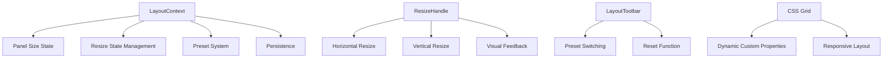

# Professional Resizable Layout System

## Overview

ClipForge now features a professional resizable layout system inspired by CapCut and iMovie, providing users with complete control over their workspace configuration. The timeline is no longer cramped at the bottom, and users can customize all panel sizes to their preference.

## Key Features

### 🎯 **Professional Layout Proportions**
- **Timeline**: 35% of screen height (vs previous 200px fixed)
- **Player**: 45% of screen width (vs previous cramped space)
- **Sidebar**: 20% of screen width (vs previous 250px fixed)
- **Controls**: 35% of screen width (vs previous 300px fixed)

### 🔧 **Resize Handles**
- **Horizontal handles** between sidebar/main and main/controls
- **Vertical handle** between main area and timeline
- **Visual feedback** on hover with professional styling
- **Smooth resize interactions** with real-time updates

### 📐 **Layout Presets**
- **Default**: Balanced layout for general use
- **Timeline**: Timeline-focused (50% height, 40% player width)
- **Player**: Player-focused (60% player width, 25% timeline height)
- **Compact**: Space-efficient layout (15% sidebar, 25% controls, 30% timeline)

### 💾 **Persistence**
- Layout preferences automatically saved to localStorage
- Restored on application restart
- Custom layouts marked as "custom" preset

## Technical Implementation

### Architecture



### Components

#### 1. LayoutContext (`src/context/LayoutContext.js`)
- **State Management**: Panel sizes, resize state, presets
- **Actions**: Resize handling, preset switching, persistence
- **Computed Values**: Min/max constraints, panel calculations

#### 2. ResizeHandle (`src/components/ui/ResizeHandle.js`)
- **Direction Support**: Horizontal and vertical resizing
- **Event Handling**: Mouse down, move, up events
- **Visual Feedback**: Hover states, active states

#### 3. LayoutToolbar (`src/components/ui/LayoutToolbar.js`)
- **Preset Buttons**: Quick access to layout configurations
- **Reset Function**: Return to default layout
- **Visual Indicators**: Active preset highlighting

### CSS Grid Implementation

```css
.app {
  display: grid;
  grid-template-columns: 
    var(--sidebar-width, 20%) 
    4px 
    1fr 
    4px 
    var(--controls-width, 35%);
  grid-template-rows: 
    auto 
    auto 
    1fr 
    4px 
    var(--timeline-height, 35%);
  grid-template-areas:
    "toolbar toolbar toolbar toolbar toolbar"
    "layout-toolbar layout-toolbar layout-toolbar layout-toolbar layout-toolbar"
    "sidebar sidebar-handle main main-handle controls"
    "timeline-handle timeline-handle timeline-handle timeline-handle timeline-handle"
    "timeline timeline timeline timeline timeline";
}
```

## User Experience

### Default Layout (Optimized for Timeline Editing)
- **Timeline**: 35% height - plenty of space for multi-track editing
- **Player**: 45% width - comfortable video preview
- **Sidebar**: 20% width - efficient import panel
- **Controls**: 35% width - comprehensive export options

### Layout Presets

#### Timeline Preset 🎬
- **Timeline**: 50% height - maximum timeline space
- **Player**: 40% width - adequate preview
- **Perfect for**: Complex multi-track editing

#### Player Preset 📺
- **Player**: 60% width - large video preview
- **Timeline**: 25% height - compact timeline
- **Perfect for**: Video review and playback

#### Compact Preset 📱
- **Sidebar**: 15% width - minimal import space
- **Controls**: 25% width - essential export options
- **Timeline**: 30% height - efficient timeline
- **Perfect for**: Smaller screens or focused workflows

### Resize Interactions

1. **Hover**: Resize handle highlights with primary color
2. **Drag**: Smooth real-time panel resizing
3. **Constraints**: Minimum/maximum sizes prevent unusable layouts
4. **Persistence**: Changes automatically saved

## Professional Features

### Visual Feedback
- **Hover States**: Handles highlight on mouse over
- **Active States**: Visual indication during resize
- **Smooth Transitions**: Professional animation timing
- **Color Consistency**: Matches ClipForge design system

### Responsive Design
- **Minimum Sizes**: Prevents panels from becoming unusable
- **Maximum Sizes**: Prevents panels from dominating screen
- **Proportional Resizing**: Maintains layout balance
- **Mobile Considerations**: Compact preset for smaller screens

### Performance
- **Efficient Updates**: Only affected panels re-render
- **Debounced Persistence**: Prevents excessive localStorage writes
- **CSS Custom Properties**: Leverages browser optimization
- **Event Optimization**: Proper cleanup of global listeners

## Usage Examples

### Switching Layout Presets
```javascript
const { setPreset } = useLayout();

// Switch to timeline-focused layout
setPreset('timeline');

// Switch to player-focused layout
setPreset('player');

// Reset to default
setPreset('default');
```

### Manual Panel Resizing
```javascript
const { setPanelSize } = useLayout();

// Set timeline to 50% height
setPanelSize('timeline', 50);

// Set sidebar to 25% width
setPanelSize('sidebar', 25);
```

### Custom Layout Persistence
```javascript
const { currentPreset } = useLayout();

// Layout automatically saves when changed
// Custom layouts marked as 'custom' preset
console.log(currentPreset); // 'custom' after manual resize
```

## Industry Comparison

### CapCut
- **Timeline Focus**: Large timeline area for mobile editing
- **Compact Sidebars**: Efficient use of screen space
- **Resizable Panels**: User customization options

### iMovie
- **Professional Layout**: Balanced proportions
- **Timeline Prominence**: Timeline gets significant space
- **Player Integration**: Seamless video preview

### Adobe Premiere Pro
- **Customizable Workspace**: Complete layout control
- **Panel Docking**: Flexible panel arrangement
- **Preset Workspaces**: Quick layout switching

## Benefits

### For Users
- **Customizable Workspace**: Adapt layout to workflow
- **Timeline Prominence**: No more cramped timeline
- **Professional Feel**: Industry-standard layout system
- **Persistent Preferences**: Layout remembers user choices

### For Developers
- **Modular System**: Easy to extend with new panels
- **Performance Optimized**: Efficient state management
- **Maintainable Code**: Clear separation of concerns
- **Extensible Design**: Easy to add new presets

## Future Enhancements

### Planned Features
- **Panel Docking**: Drag-and-drop panel arrangement
- **Workspace Profiles**: Multiple saved layouts
- **Keyboard Shortcuts**: Quick preset switching
- **Panel Minimization**: Collapsible panels

### Advanced Customization
- **Custom Presets**: User-defined layout configurations
- **Panel Groups**: Related panels that resize together
- **Layout Templates**: Import/export layout configurations
- **Smart Layouts**: Automatic layout based on content

## Technical Notes

### Browser Compatibility
- **CSS Grid**: Modern browsers (IE11+ with prefixes)
- **Custom Properties**: Modern browsers (IE11+ with fallbacks)
- **localStorage**: Universal support
- **Event Handling**: Standard DOM events

### Performance Considerations
- **Resize Throttling**: Prevents excessive updates
- **Memory Management**: Proper cleanup of event listeners
- **CSS Optimization**: Leverages browser rendering optimizations
- **State Efficiency**: Minimal re-renders

### Accessibility
- **Keyboard Navigation**: Resize handles accessible via keyboard
- **Screen Reader Support**: Proper ARIA labels
- **High Contrast**: Respects user preferences
- **Focus Management**: Clear focus indicators

## Conclusion

The professional resizable layout system transforms ClipForge from a basic video editor into a professional-grade application. Users now have complete control over their workspace, with the timeline receiving the prominence it deserves. The system is inspired by industry leaders while maintaining ClipForge's unique identity and user experience.

This implementation provides a solid foundation for future layout enhancements and ensures ClipForge can compete with professional video editing applications in terms of workspace customization and user experience.
